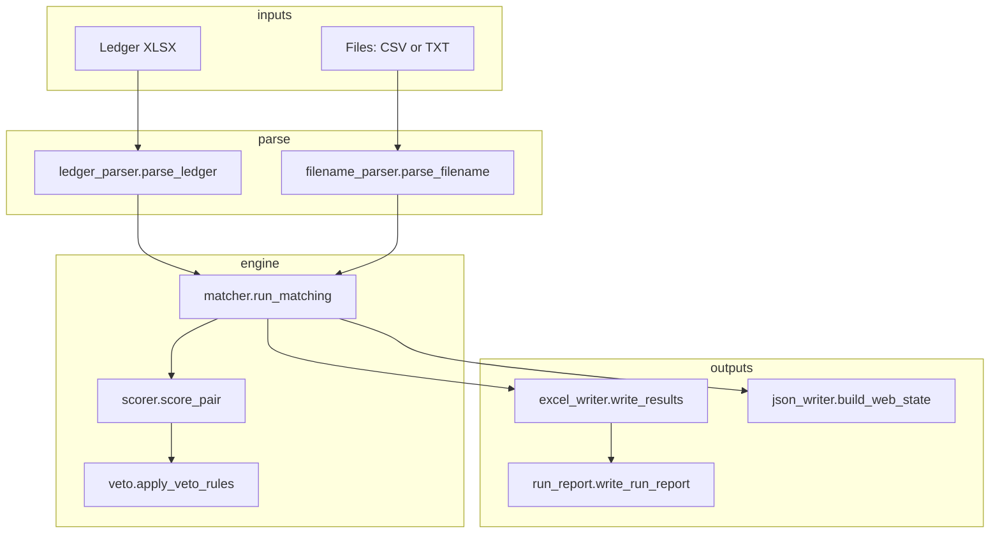

# File-to-Ledger Matching Engine — Implementation Guide

This document describes how the MATCH pipeline works end to end: parsing inputs, scoring candidate pairs, applying veto rules, assigning one ledger row to each file (with capacity for multi-amount invoices), classifying confidence, and emitting outputs. It includes concrete examples, configuration reference, architecture, and how the automated tests map to behaviors.

---

## 1. Architecture



| Layer | Role | Key modules |
|-------|------|-------------|
| **Entry** | CLI (`main.py`), scripts (`build_web_state.py`), Next.js API routes | Load ledger + file list, pass filenames as strings |
| **Parse** | Structured models from raw data | `src/parsers/ledger_parser.py`, `src/parsers/filename_parser.py` |
| **Core** | Score → veto → greedy 1:1 assignment → optional sum pass → tier + ambiguity | `src/engine/matcher.py`, `scorer.py`, `veto.py` |
| **Explain** | Human-readable text for Excel / JSON / UI | `src/engine/explainer.py` |
| **Config** | Weights, thresholds, tier labels | `config.py` (imported as `config`) |
| **Output** | Excel workbook, HTML run report, `web_state.json` | `src/output/excel_writer.py`, `run_report.py`, `json_writer.py`, `sharepoint_links.py` |

**Data models** (`src/models.py`):

- `LedgerRow` — index, vendor, date, `ca_code`, folder, `amount`
- `FileRecord` — original filename plus extracted `amounts`, `ca_codes`, `vendor_tokens`, dates, invoice/job numbers
- `ScoredCandidate` — file + score + `reasons[]` + optional `vetoed` / `veto_reason`
- `MatchResult` — ledger row, optional matched file, status, alternatives, ambiguity, veto log inputs

---

## 2. Pipeline Stages (Implementation Order)

### Stage A — Parse filenames

`parse_filename(name)` walks the string with regexes (order matters):

1. Strip extension (`.pdf`, `.xlsx`, …)
2. Dates: `M.DD.YYYY`, `MM-DD-YYYY`, compact `YYYYMMDD`
3. Invoice tokens (`Inv …`) before dollar amounts (avoids mistaking invoice IDs for money)
4. Check numbers removed so they do not become “vendor”
5. CA codes: `CA 50670` → digits stored in `ca_codes`
6. Job numbers (`JB …`)
7. Dollar amounts `$…` and fallback bare decimals `80.63`
8. Remaining alphanumeric chunks become `vendor_tokens`, minus `config.NOISE_WORDS`

**Example:**  
`VYO Structural Ca 65100 $2,500 3.15.2024.pdf`  
→ amounts `2500`, CA `65100`, vendor tokens from “VYO Structural”, date 2024-03-15.

### Stage B — Score each ledger row × each file

`score_pair(ledger_row, file_record)` adds weighted signals:

| Signal | Config constant | Typical `reasons` value |
|--------|-----------------|-------------------------|
| Amount exact | `AMOUNT_EXACT_WEIGHT` (50) | `amount_exact` |
| Amount within tolerance | `AMOUNT_NEAR_WEIGHT` (40) | `amount_near` |
| CA in file matches ledger | `CA_MATCH_WEIGHT` (30) | `ca_match` |
| Vendor fuzzy strong | `VENDOR_STRONG_WEIGHT` (20) | `vendor_match` |
| Vendor fuzzy partial | `VENDOR_PARTIAL_WEIGHT` (10) | `vendor_partial` |
| Invoice hint (ledger amount appears in file invoice string) | `INVOICE_MATCH_WEIGHT` (5) | `invoice_hint` |
| Penalty if file has **more than one** amount | `MULTI_AMOUNT_PENALTY` (5) | `multi_amount_penalty` |

Vendor fuzzy uses `rapidfuzz` (`ratio`, `token_sort_ratio`, `partial_ratio`, etc.) on ledger string vs joined file tokens; common prefixes like “the ” are stripped for scoring.

**Numeric example (illustrative):**  
Ledger: amount **100**, CA **50670**, vendor **Home Depot**.  
File: **$100**, **CA 50670**, tokens **home depot**.  
→ `amount_exact` (+50), `ca_match` (+30), `vendor_match` (+20) → raw **100**, clamped to 100.

### Stage C — Veto rules

`apply_veto_rules` runs **after** scoring. Principle: **missing** file data does **not** veto; **wrong** conflicting data does.

1. **CA mismatch** — File lists CA codes and ledger CA is not among them → veto  
2. **Amount conflict** — File has amounts, none equal or within abs/rel tolerance of ledger amount → veto  
3. **Vendor mismatch** — File has vendor tokens and `get_vendor_similarity` is **below** `VENDOR_VETO_THRESHOLD` (45) → veto  

Vetoed candidates stay in the matrix for diagnostics (`vetoed_candidates` on `MatchResult`) but are sorted last and never win assignment.

**Example:** Ledger CA **50670**, file shows **CA 65100** only → veto with reason citing both sides.

### Stage D — Greedy 1:1 assignment

For each ledger row, non-vetoed candidates with score **> 0** are sorted by score. Global list `(row_idx, file_idx, score, candidate)` is sorted descending.

Greedy: assign highest score edges first; skip row already assigned; skip file if it has reached **capacity** `max(len(file.amounts), 1)` (so a file with two dollar amounts can match **two** ledger rows when scores support it).

### Stage E — Partial payment sum pass

`_partial_payment_pass` handles **unmatched** rows only. Groups them by `(vendor_lower, ca_code)`. For each pair of rows in a group, if **sum of their amounts** equals (or is within tolerance of) an amount on some file, and vendor/CA checks pass, both rows get synthetic candidates with reasons including `amount_sum_match` and a score built from `AMOUNT_SUM_WEIGHT` + CA/vendor bonuses (see `matcher.py`).

### Stage F — Status tier + ambiguity

**Ambiguity** (`_is_ambiguous`): after a winner is chosen, if another **non-vetoed** file has score within `AMBIGUITY_SCORE_GAP` (15) **and** at least one core signal, the match is flagged `is_ambiguous=True`.

**Five tiers** (`_classify`) depend on how many of **amount / CA / vendor** fired (`signal_count` 0–3), whether amounts are “direct” (`amount_exact`/`amount_near`) vs sum-match only, and ambiguity — including **vendor-only** matches capped at **Review**.

| Tier | Typical meaning |
|------|-----------------|
| **Confident** | 3 signals, direct amount, not ambiguous |
| **Probable** | 3 signals but ambiguous; or strong 2-signal patterns |
| **Possible** | Weaker or sum-based 3-signal; or 2-signal with ambiguity; or single strong amount |
| **Review** | Vendor-only; or weak single-signal; CA-only patterns |
| **No Match** | No assignment or no qualifying signals |

Exact branch logic is in `matcher._classify` — treat that function as the source of truth.

### Stage G — Explanations

`explainer.explain`, `explain_ambiguity`, and `format_signals` turn `MatchResult` into strings for Excel columns and JSON (`signals` like `3/3 (amount_exact + ca + vendor)`).

---

## 3. CLI and outputs

**`main.py`** (typical):

```bash
python main.py --ledger "inputs/Milford-Ledger Clean.xlsx" --files "inputs/dropbox_files.csv" --output "outputs/results.xlsx" --base-path ""
```

- **`--files`**: CSV with `Filename` and optional path column (`Path From Root`, etc.) **or** a plain text file with one filename per line.
- **`--base-path`**: When set, file links use this prefix + relative path for hyperlinks and HTML report.
- Writes Excel (multiple sheets including match results and veto log), and `{stem}_report.html` with open-in-app links unless `--no-open-report`.

**Dashboard JSON:** `scripts/build_web_state.py` runs the same matcher and writes `outputs/web_state.json` via `json_writer` for the Next.js app.

---

## 4. Configuration reference (`config.py`)

| Constant | Approx. role |
|----------|----------------|
| `AMOUNT_EXACT_WEIGHT` / `AMOUNT_NEAR_WEIGHT` / `AMOUNT_SUM_WEIGHT` | Amount signal strength |
| `CA_MATCH_WEIGHT`, `VENDOR_STRONG_WEIGHT`, `VENDOR_PARTIAL_WEIGHT` | CA / vendor |
| `INVOICE_MATCH_WEIGHT`, `MULTI_AMOUNT_PENALTY` | Tie-breaker / ambiguity penalty |
| `VENDOR_STRONG_THRESHOLD` / `VENDOR_PARTIAL_THRESHOLD` | Fuzzy ratios for scoring |
| `VENDOR_VETO_THRESHOLD` | Below this → vendor veto when file has vendor tokens |
| `AMOUNT_ABS_TOLERANCE`, `AMOUNT_REL_TOLERANCE` | Near-match and veto tolerance ($1 abs, 0.5% rel) |
| `TIER_*` | Excel styling and labels |
| `AMBIGUITY_SCORE_GAP` | Near-tie window |
| `NOISE_WORDS` | Stripped from vendor tokens in filenames |

---

## 5. Test suite — what each file covers

Tests use **real fixtures** where noted: `inputs/Milford-Ledger Clean.xlsx` and `inputs/dropbox_files.csv` (`conftest.py`). **234 tests** are collected (see commands below).

| Module | Focus |
|--------|--------|
| `test_filename_parser.py` | Dates, CA, amounts, invoices, jobs, vendor tokens, noise stripping, full filename golden cases |
| `test_ledger_parser.py` | XLSX row parsing, CA/amount/date invariants on real ledger |
| `test_scorer.py` | Amount/CA/vendor/invoice scoring, multi-amount penalty, tolerance math, `get_vendor_similarity`, `_strip_prefix` |
| `test_veto.py` | CA, amount, vendor vetoes; multi-amount veto behavior; absence-is-neutral; threshold 45 vs 44 |
| `test_matcher.py` | End-to-end small examples: veto in loop, 1:1 vs duplicates, multi-amount capacity, sum pass, alternatives, all five tiers, ambiguity thresholds (gap 15 vs 14), edge cases |
| `test_explainer.py` | Prose explanations, ambiguity text, `format_signals` |
| `test_models.py` | `MatchResult.signal_count`, `match_reason_str`, `confidence` |
| `test_excel_writer.py` | Sheet layout, paths, hyperlinks, summary, veto log sheet |
| `test_sharepoint_links.py` | Path normalization, SharePoint URL shape, `FILE_LINK_BASE` |
| `test_integration.py` | Full run on real ledger + CSV: counts, specific row expectations (Confident / Probable / multi-amount / no match), invariants |

---

## 6. Commands

From the **repository root**:

```bash
# Dependencies (Makefile uses /tmp/filemanager_venv by default)
make install

# Full suite — verbose (same as CI-style local check)
make test
```

Equivalent without Make (after creating any venv and `pip install -r requirements.txt`):

```bash
pytest tests/ -v
```

Quick (no per-test names):

```bash
make test-quick
# or: pytest tests/
```

**Last verified collection count:**

```bash
pytest tests/ --collect-only -q
```

(Expect **234** tests with the current tree.)

Other useful targets (see `make help`):

- `make run` — run matcher with default `LEDGER` / `FILES` from Makefile
- `make web-state` — regenerate `outputs/web_state.json`

---

## 7. Related code pointers

- Matching orchestration: `src/engine/matcher.py` — `run_matching`
- Weights and thresholds: `config.py`
- Scoring details: `src/engine/scorer.py` — `score_pair`
- Hard rejects: `src/engine/veto.py` — `apply_veto_rules`
- Filename structure: `src/parsers/filename_parser.py` — `parse_filename`
- CLI: `main.py`

When in doubt, **the running code in `matcher.py`, `scorer.py`, and `veto.py` overrides this document**; update this file if behavior changes.
